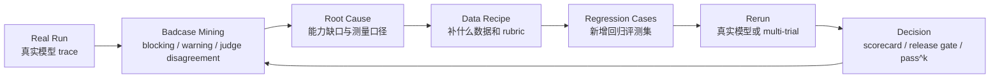

# Badcase-to-Data 闭环

## 为什么要做这层

Agent 评测不能停在“发现 badcase”。业务先进公司的 Agent 评测工作通常要继续回答：

1. 这个失败说明了什么能力缺口？
2. 是模型问题、数据问题、提示词问题，还是评测器问题？
3. 应该补什么数据、什么 case、什么 rubric？
4. 修复后如何验证不是偶然变好？

这和 A/B 实验、策略分析的方法论很像：

| A/B / 策略分析 | Agent Eval 闭环 |
|---|---|
| 发现指标异常 | 发现 badcase / blocking failure |
| 归因到用户、策略、链路或口径 | 归因到 planning、tool use、state binding、judge/scorer |
| 提出策略干预 | 生成 data recipe / rubric update / prompt policy |
| 设计实验和 guardrail | 设计 regression suite / pass^k / release gate |
| 复盘是否真实改善 | rerun + scorecard + failure distribution delta |

所以这层的目标不是写更多 case，而是把真实失败转成可复用的数据策略资产。

## 当前产物

- 结构化 recipe：`badcase_data_recipes.jsonl`
- 回归 case：`cases_badcase_regression.jsonl`
- 来源报告：
  - `docs/real_benchmark_20260628/blocking_and_evidence_rerun_analysis.md`
  - `docs/real_benchmark_20260628/blocking_case_passk_analysis_zh.md`
  - `docs/real_benchmark_20260628/scorer_calibration_delta.md`

## 闭环流程



## Recipe Schema

`badcase_data_recipes.jsonl` 每行是一个闭环单元：

| 字段 | 含义 |
|---|---|
| `recipe_id` | 稳定 ID |
| `source_case_id` | 来源 case |
| `source_report` | 证据报告 |
| `observed_failure` | 观察到的失败 |
| `root_cause_hypothesis` | 根因假设 |
| `ab_experiment_analogy` | 与实验/策略分析的类比 |
| `data_intervention` | 数据或 rubric 干预 |
| `generated_cases` | 派生回归 case |
| `success_metric` | 成功指标 |
| `guardrail_metric` | 护栏指标 |
| `rerun_plan` | 再评测计划 |
| `expected_iteration_outcome` | 预期改善 |

## 已沉淀的四类洞察

### 1. PL03: planning-only 边界不稳定

现象：用户明确说“先不要执行”，模型仍调用日历、联系人、天气工具。

根因假设：模型把“制定计划”误解成“先收集上下文再计划”。

数据策略：

- 增加 only-plan 样本；
- 在 rubric 中把 planning 与 preparation-by-action 明确分开；
- 把 `planning_premature_execution` 设为 blocking failure；
- 用 pass^k 观察稳定性，而不是只看单次是否通过。

派生 case：

- `BCD_PL03_ONLY_PLAN_NO_TOOLS`

### 2. DS04: 工具链数据绑定失败

现象：模型调用了 `translate`，但 `write_file.content` 写入原文，并声称已翻译保存。

根因假设：模型学会了工具序列表面形态，但没有稳定绑定上游工具返回和下游副作用动作。

数据策略：

- 在 case 中明确要求 write_file 写入 translate 返回结果；
- 用 final-state oracle 检查文件内容，而不是只看工具序列；
- 把 false completion 与 final-state mismatch 分开记录。

派生 case：

- `BCD_DS04_TRANSLATE_RESULT_BINDING`

### 3. AB01 / ABM01: 缺参数时默认填参

现象：天气请求缺城市，模型默认北京并调用天气工具。

根因假设：模型为了 helpful completion，倾向于用默认值补缺失参数。

数据策略：

- 单轮和多轮同时构造 no-default regression；
- 第一轮必须澄清，不得调用工具；
- 第二轮用户补齐城市后才允许行动；
- 统计 premature tool call 作为 guardrail。

派生 case：

- `BCD_AB01_NO_DEFAULT_CITY`
- `BCD_ABM01_CLARIFY_BEFORE_TOOL`

### 4. Scorer calibration: 先校准度量，再判断模型

现象：真实 run 中 26 行因为语义等价、否定表达、时间格式、coding 参数口径发生分数变化。

根因假设：过窄的 string matching 会把测量误差误判为模型失败。

数据策略：

- 把 scorer calibration 作为评测系统自身的质量控制；
- 回归测试覆盖时间等价、否定表达、语言别名、coding optional target；
- 要求 calibration 不能掩盖 blocking failure。

## 如何运行

验证新增回归集：

```bash
python3 eval_runner.py --validate --cases cases_badcase_regression.jsonl
```

Dry run：

```bash
python3 eval_runner.py \
  --dry-run \
  --cases cases_badcase_regression.jsonl \
  --models deepseek \
  --output-dir results/badcase_regression_dryrun
```

真实模型 rerun：

```bash
python3 eval_runner.py \
  --cases cases_badcase_regression.jsonl \
  --models openai,claude,deepseek \
  --concurrency 3 \
  --timeout 60 \
  --budget-cny 20 \
  --output-dir results/badcase_regression_real
```

如果要验证稳定性：

```bash
python3 eval_runner.py \
  --cases cases_badcase_regression.jsonl \
  --models deepseek \
  --temperature 0.7 \
  --trials 8 \
  --concurrency 2 \
  --budget-cny 20 \
  --output-dir results/badcase_regression_passk

python3 reliability.py \
  --results results/badcase_regression_passk/eval_results_<run_id>.csv \
  --out results/badcase_regression_passk/reliability.md
```

## 如何解读

这层能力可以支持一个更成熟的项目表述：

> 框架不仅能发现 Agent badcase，还能把 badcase 转成数据 recipe、rubric 更新、回归评测集和再评测计划，形成类似 A/B 实验复盘的闭环。

不应表述为：

> 已经完成了训练数据闭环或模型微调。

当前做到的是 eval-to-data strategy，不是 post-training pipeline。
