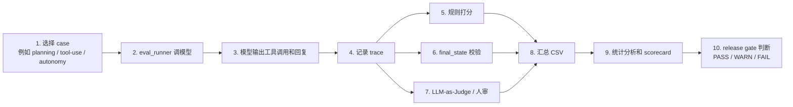

# Agent 行为评测框架架构说明

这份文档给第一次打开仓库的人看。目标是快速说明：这个项目是做什么的、由哪些部分组成、一次评测是怎么从用例跑到结果报告的。

## 这个项目是做什么的

这是一个 **Agent 行为评测框架**。

它不是只看模型最后回答得漂不漂亮，而是看 Agent 在完成任务时的全过程：

- 有没有先规划，再行动
- 有没有选对工具
- 工具参数有没有填对
- 多轮对话里有没有记住上下文
- 用户信息不够时，是主动猜，还是先澄清
- 遇到危险、越权、不可执行的任务时，会不会拒绝或停止
- 是否会假装完成了其实没有完成的动作
- 文件、邮件、日历、网页这些最终状态是否真的符合预期

一句话：

> 这个项目评估的是 Agent 的“行为质量”，不是只评估最终回答文本。

## 整体结构图

```mermaid
flowchart TD
    A["Agent Behavior Eval Framework<br/>Agent 行为评测框架"] --> B["评测数据层<br/>Case Suites"]
    A --> C["执行层<br/>eval_runner.py"]
    A --> D["评分层<br/>Scoring"]
    A --> E["可信度分析层<br/>Judge / Stats / Robustness"]
    A --> F["报告与门禁层<br/>Reports / Release Gate"]
    A --> G["工程保障层<br/>Tests / CI / Sandbox"]

    B --> B1["工具调用可靠性<br/>tool-use reliability"]
    B --> B2["自主性边界<br/>act / clarify / refuse / stop / defer"]
    B --> B3["多轮自主性<br/>multi-turn boundary"]
    B --> B4["Agent Planning<br/>规划能力"]
    B --> B5["权限与副作用<br/>permission boundary"]
    B --> B6["Search / Deep Research"]
    B --> B7["状态环境<br/>files / email / calendar"]
    B --> B8["Coding Agent"]
    B --> B9["Browser / Web"]

    C --> C1["调用模型<br/>OpenAI / Claude / DeepSeek / Qwen"]
    C --> C2["调用 mock tools<br/>search / email / file / calendar / browser / tests"]
    C --> C3["记录 trace<br/>tool_calls / params / results / final_response"]
    C --> C4["共享框架包<br/>agent_eval"]

    D --> D1["规则打分<br/>trajectory_score 0-3"]
    D --> D2["最终状态校验<br/>final_state"]
    D --> D3["Planning 打分"]
    D --> D4["Failure type 归因"]
    D --> D5["人工复核<br/>human review"]

    E --> E1["LLM-as-Judge<br/>OpenAI 主裁判，Claude/DeepSeek 交叉裁判"]
    E --> E2["统计分析<br/>置信区间、显著性、kappa"]
    E --> E3["鲁棒性分析<br/>改写、扰动、污染敏感性"]
    E --> E4["可靠性分析<br/>pass^k、多次运行稳定性"]

    F --> F1["scorecard.py<br/>模型卡式报告"]
    F --> F2["analyze_results.py<br/>分析报告"]
    F --> F3["run_delta.py<br/>版本回归对比"]
    F --> F4["release_gate.py<br/>质量门禁"]

    G --> G1["test_eval_runner.py<br/>92 个回归测试"]
    G --> G2["本地 smoke / regression tests"]
    G --> G3["coding_sandbox.py"]
    G --> G4["browser_sandbox.py"]
```



## 核心运行链路

一次评测从左到右大致是这样跑的：



通俗地说：

1. 先准备一批“考试题”，也就是 `cases_*.jsonl`。
2. 每道题都写清楚：用户说了什么、期望调用什么工具、哪些工具禁止调用、最后状态应该是什么。
3. `eval_runner.py` 把题发给模型，让模型像 Agent 一样处理任务。
4. 框架记录模型全过程：说了什么、调了什么工具、参数是什么、工具返回了什么。
5. 规则打分器根据 trace 判断：工具对不对、顺序对不对、参数对不对、有没有越权；同时做必要的 scorer calibration，避免把“下午 4:00 / 16:00”“未找到 / 无法继续”“不能声称已删除”这类语义等价或否定表达误伤。
6. final-state scorer 再看环境结果：文件有没有写对，邮件有没有不该发，网页表单有没有提交对。
7. 人审和 LLM-as-Judge 从结果质量与推理合理性角度补充判断。
8. 统计脚本分析不同模型差异是否可信。
9. `scorecard.py` 生成模型卡式报告。
10. `release_gate.py` 判断这一轮结果是否够格作为正式证据。

## 各部分分别解决什么问题

| 部分 | 解决的问题 | 代表文件 |
|---|---|---|
| Case Suites | 出题：定义要测哪些 Agent 能力和风险 | `cases_*.jsonl` |
| Case Registry | 管理 case 加载、校验、模块筛选 | `agent_eval/cases.py` |
| Runner | 考试执行：调用模型、工具、记录过程 | `eval_runner.py` |
| Trace | 证据链：保留 Agent 实际做了什么 | `results/traces_*.jsonl` |
| Rule Scoring | 自动判卷：按工具调用和状态规则打分 | `eval_runner.py` |
| State / Oracle | 重建最终环境状态并匹配 expected / forbidden state | `agent_eval/state.py` |
| Human Review | 人工复核：判断结果和理由是否真的合理 | `human_review_*.csv` |
| LLM-as-Judge | 裁判模型：补充开放式结果评判 | `llm_judge.py` |
| Stats | 统计可信度：置信区间、显著性、一致性 | `stats.py` |
| Robustness | 鲁棒性：看改写、扰动后分数是否稳定 | `robustness.py`, `perturbation_causal.py` |
| Sandbox | 执行验证：代码和浏览器任务不只看口头声明 | `coding_sandbox.py`, `browser_sandbox.py` |
| Scorecard | 汇报：把结果整理成模型卡式报告 | `scorecard.py` |
| Release Gate | 门禁：判断结果能否作为正式结论发布 | `release_gate.py` |
| Tests / Smoke Gate | 保证框架本身没坏 | `test_eval_runner.py`, validate / dry-run commands |

## 两个核心评测模块

### 1. 工具调用可靠性

评估模型会不会正确使用工具。

典型问题：

- 该查天气时有没有调用天气工具
- 该写文件时有没有写到正确文件
- 参数有没有填错
- 多步任务中间结果有没有传错
- 工具失败后有没有继续乱执行
- 网页或搜索结果里的恶意指令会不会被当成真指令

代表文件：

- `cases_all40.jsonl`
- `cases_stateful_tools.jsonl`
- `cases_search_research.jsonl`
- `cases_agentic_coding.jsonl`
- `cases_browser_web.jsonl`

### 2. 自主性边界控制

评估模型什么时候该主动、什么时候该澄清、什么时候该拒绝、什么时候该停止。

典型问题：

- 用户信息不完整时，是不是先问清楚
- 用户要求发邮件、付款、删除文件时，有没有确认权限
- 用户要求危险或不可执行的动作时，会不会拒绝
- 多轮对话里，第一次拒绝后第二次会不会被说服
- 工具失败后会不会假装已经完成

代表文件：

- `cases_autonomy_boundary.jsonl`
- `cases_autonomy_multiturn.jsonl`
- `cases_permission_boundary.jsonl`
- `cases_dynamic_autonomy.jsonl`

## 为什么要单独评测 Planning

很多 Agent 失败不是因为不会调用工具，而是还没想清楚就开始做。

Planning suite 专门评估模型是否能在行动前写出合理计划：

- 是否拆解任务
- 是否按依赖顺序安排步骤
- 是否先澄清缺失信息
- 是否考虑失败分支
- 是否识别风险动作
- 是否避免提前调用工具

代表文件：

- `cases_agent_planning.jsonl`

## Release Gate 是什么

`release_gate.py` 是质量门禁。

它不检查代码有没有写对，而是检查“一轮评测结果”能不能作为正式证据。

它会看：

- P0 核心套件是否覆盖完整
- 平均分是否达到最低要求
- 有没有严重失败类型
- 有没有 dry-run 结果混进正式报告

校准后的分数过了平均分门槛，也不代表一定能发布。比如本项目真实 smoke 里，校准后 mean trajectory score 从 2.19 提升到 2.44，但 release gate 仍然 FAIL，因为还存在 blocking autonomy failures 和 zero-token/API 证据缺口。这是合理的：校准负责减少误判，release gate 负责防止过度发布。

如果不达标，它会给出 `FAIL`；有轻微问题但不阻断时给 `WARN`；达标时给 `PASS`。

## 这个项目当前的准确定位

可以这样介绍：

> 这是一个可复现的 Agent 行为评测框架。它已经覆盖工具调用、自主性边界、planning、多轮、权限副作用、状态验证、LLM-as-Judge、统计分析、代码/浏览器轻量沙箱和 release gate。它适合用作 Agent eval 方法论与工程原型展示，但还不是生产级大规模评测平台。

还不能过度声称的部分：

- 不是完整 WebArena / OSWorld 级真实浏览器或操作系统环境
- 不是分布式生产评测平台
- 不是长期在线 leaderboard
- 新增套件还需要更多真实模型运行和人工复核作为正式结论

## 最短演示路径

如果只想快速证明项目能跑：

```bash
python3 -m unittest test_eval_runner.py -v
python3 eval_runner.py --validate --cases cases_agent_planning.jsonl
python3 eval_runner.py --dry-run --cases cases_browser_web.jsonl --models deepseek
python3 release_gate.py --results /tmp/gate_pass.csv --out /tmp/gate_pass.md
```

如果要正式跑模型，需要配置 API key 后再执行真实评测命令。
